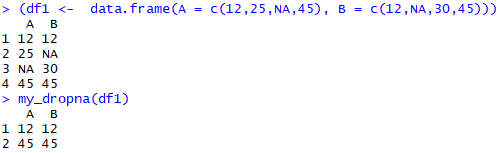
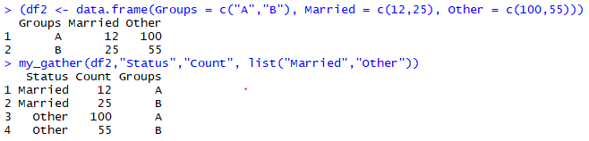
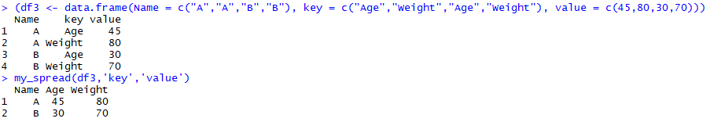
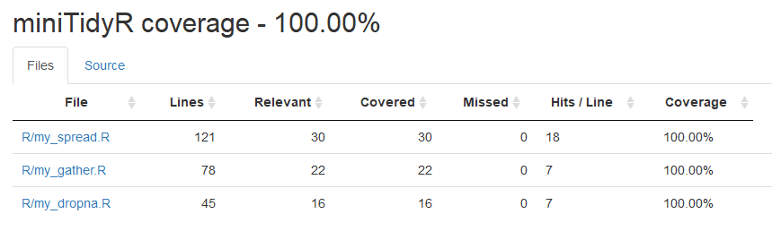
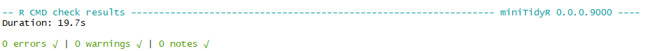
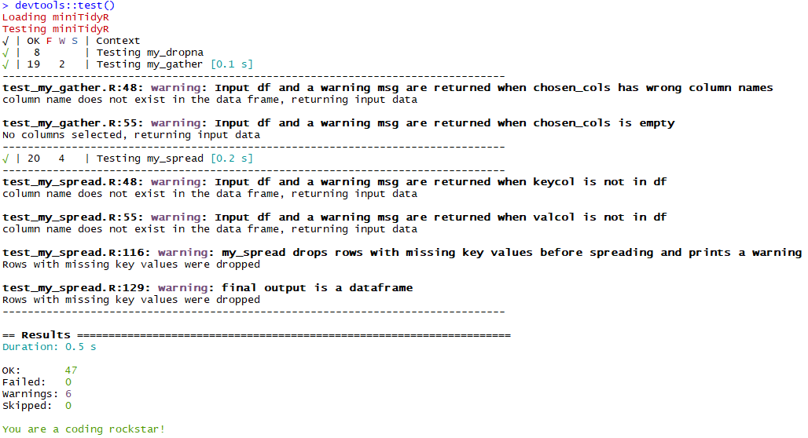

# R Mini Tidy Package : `miniTidyR`

### Contributors:
- Huijue Chen (`huijuechen`)
- Luo Yang (`lyiris22`)
- Orphelia Ellogne (`ellognea`)

### Summary
We re-implemented R’s <a href="https://tidyr.tidyverse.org/reference/gather.html"> gather </a>,<a href="https://tidyr.tidyverse.org/reference/spread.html"> spread </a>, and <a href="https://tidyr.tidyverse.org/reference/drop_na.html"> drop_na </a> functions that exist in the `tidyverse` package.

Our functions are called `my_gather` , `my_spread` and `my_dropna`:

- `my_gather()` : Transform a data from wide to long by combining columns. For selected columns, put the columns names into a column of keys, and the values into a column of values.
- `my_spread()` : Transform a data from long to wide.  Select a ‘key’ column whose content will be the names of the new columns. Select a ‘value’ column whose content will be the values of the new columns.
- `my_dropna()` : Remove rows that contain `NA` values from a data frame.

### Installation
To install and load `miniTidyR` run :  

- `devtools::install_github("https://github.com/UBC-MDS/miniTidyR")`
- `library(miniTidyR)`

To access the vignette run:

- `devtools::install(build_vignettes=TRUE)`
-  `browseVignettes("miniTidyR")`

### Function usage examples

#### `my_dropna`

```
df1 <- data.frame(A = c(12,25,NA,45), B = c(12,NA,30,45))
my_dropna(df1)
```



#### `my_gather`

```
df2 <- data.frame(Groups = c("A","B"), Married = c(12,25), Other = c(100,55))
my_gather(df2, "Status", "Count", list("Married","Other"))
```



#### `my_spread`

```
df3 <- data.frame(Name = c("A","A","B","B"), key = c("Age","Weight","Age","Weight"), value = c(45,80,30,70))
my_spread(df3,"key","value")
```



### Branch coverage



### Check output



### Test output



**Please note that these 6 warnings are part of the code**
